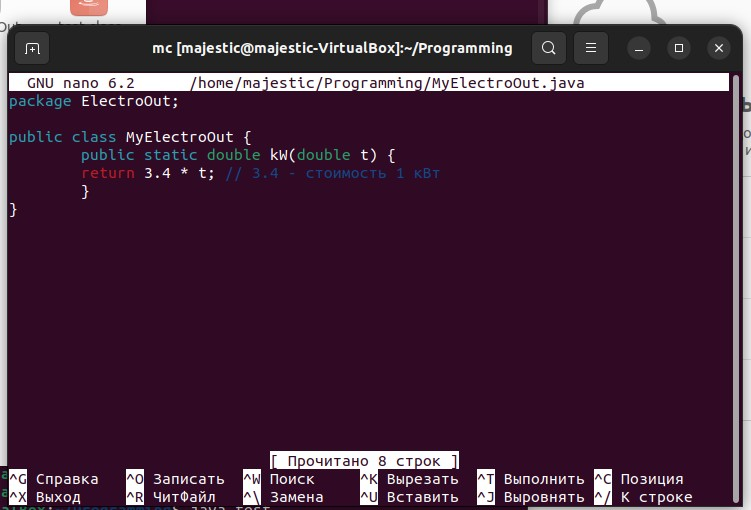
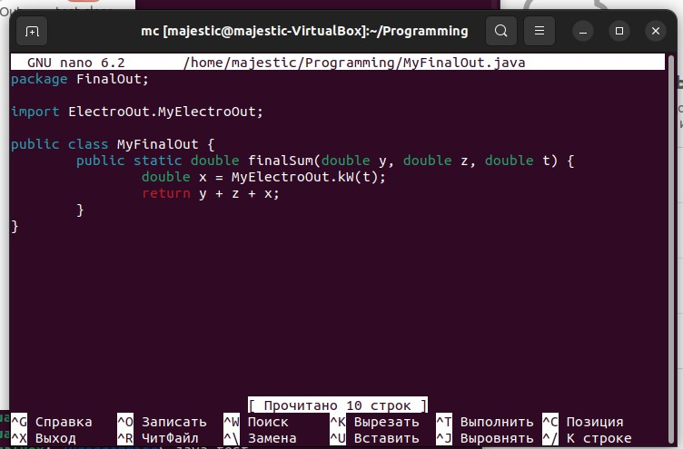
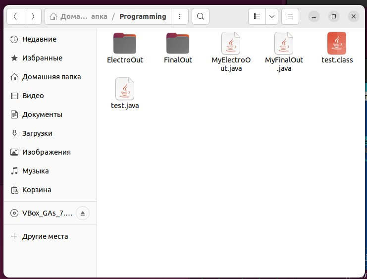
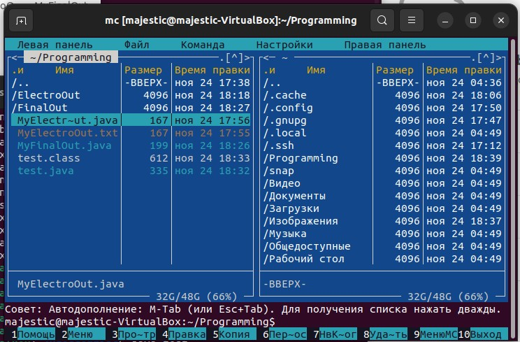

# Linux (ubuntu)
---
## Задание:
### Оформленный класс MyElectroOut:

### Оформленный класс FinalOut:

### Содержимое папки в Linux:

### Содержимое через Midnight Commander:

### Результат программы:
.jpg)

